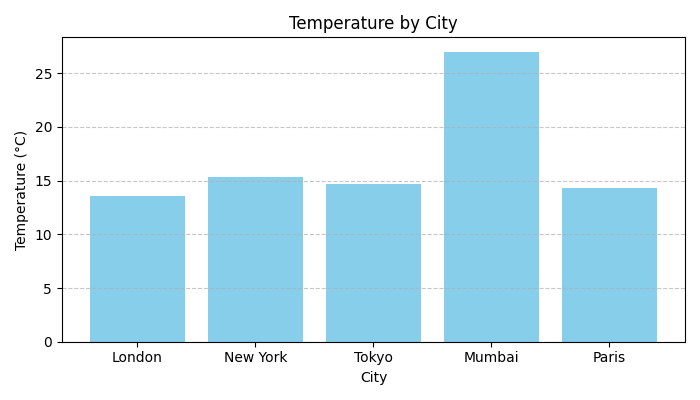

# 🌦️ Weather Data ETL Pipeline


A fully automated **ETL pipeline** built using Python and PostgreSQL that fetches live weather data from the **OpenWeather API**, transforms it using **Pandas**, and loads it into a PostgreSQL database. Includes detailed **logging**, **error handling**, and secure environment variable management via `.env`.

---

## 🚀 Features
- Extracts live weather data for multiple cities from the OpenWeather REST API  
- Transforms raw JSON into clean tabular format using Pandas  
- Loads structured data into PostgreSQL using `psycopg2`  
- Includes detailed logging for every ETL step  
- Uses `.env` for secure configuration and credential management
  
---

## 📊 Weather Data Visualization

After running the ETL pipeline, the script generates a temperature comparison chart for all cities.



---

## 🧱 Tech Stack
**Languages:** Python, SQL  
**Libraries:** Pandas, Requests, psycopg2, dotenv, Logging  
**Database:** PostgreSQL  
**Tools:** VS Code, pgAdmin, GitHub  

---

## ⚙️ Setup Instructions

### 1️⃣ Clone the Repository
```bash
git clone https://github.com/dkrapansh/weather-etl-pipeline.git
cd weather-etl-pipeline
